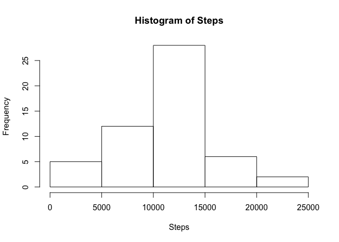
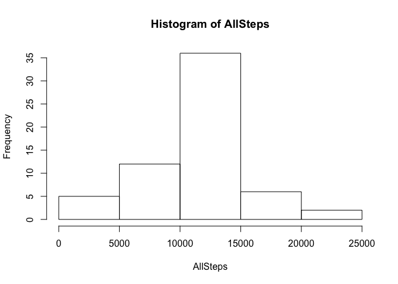

# Reproducible Research: Peer Assessment 1


## Loading and preprocessing the data
In this step, we read the csv file and filter out the rows with missing values.

```r
orig <- read.csv("activity.csv")
clean <- orig[!is.na(orig$steps),]
```

## What is mean total number of steps taken per day?
Here, we use tapply to sum steps over each day. Some days are not included in the date, so the NA values that arise must be filtered out before constructing the histogram.hist

```r
options(scipen = 3)
Steps <- tapply(clean$steps, clean$date, sum)
Steps <- Steps[!is.na(Steps)]
hist(Steps)
```

 

```r
MeanSteps <- round(mean(Steps))
MedianSteps <- round(median(Steps))
```
The mean of the total steps per day is 10766 steps. The median of the total steps per day is 10765 steps.

## What is the average daily activity pattern?

```r
library(ggplot2)

# Average the steps over each interval
acrossDates <- tapply(clean$steps, clean$interval, mean)
df <- data.frame(intervals = unique(clean$interval), avgSteps = acrossDates)
qplot(intervals, avgSteps, data = df, geom = "line")
```

 

```r
# Find interval corresponding to max average steps
maxint <- df$intervals[df$avgSteps == max(df$avgSteps)]
```
The maximum of the average steps is 206, which occurs in the 835th interval.

## Imputing missing values

```r
# Sum number of missing values
NAsum <- sum(!complete.cases(orig))

# Replace missing values with average of non-missing values
data <- orig
data$steps[is.na(data$steps)] <- mean(clean$steps)
```
This dataset contains 2304 NA values. These values are replaced with the average of the available values, 37.3825996 and are stored in a new dataset, `data`.

## Are there differences in activity patterns between weekdays and weekends?

```r
library(lubridate)
library(chron)
library(lattice)

# Determine if date is weekday/weekend
data <- transform(data, weekend = is.weekend(ymd(data$date)))
data$weekend <- factor(data$weekend, levels = c("FALSE", "TRUE"), labels = c("weekday", "weekend"))

# Split steps and intervals into weekday/weekend 
wksteps <- split(data$steps, data$weekend)
wkints <- split(data$interval, data$weekend)

# Combine steps and intervals into weekday/weekend 
df_day <- data.frame(interval = wkints$weekday, steps = wksteps$weekday)
avgDay <- tapply(df_day$steps, df_day$interval, mean)
tmpDay <- data.frame(interval = unique(data$interval), steps = avgDay, day = rep("weekday", length(avgDay)))

df_end <- data.frame(interval = wkints$weekend, steps = wksteps$weekend)
avgEnd <- tapply(df_end$steps, df_end$interval, mean)
tmpEnd <- data.frame(interval = unique(data$interval), steps = avgEnd, day = rep("weekend", length(avgEnd)))

# Combine weekday/weekend data frames into master data frame
avgs <- rbind(tmpDay, tmpEnd)

# Panel plot
xyplot(steps ~ interval|day, data = avgs, type = "l", layout = c(1, 2))
```

 
